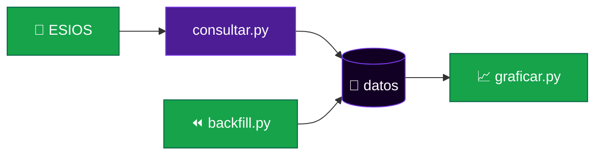
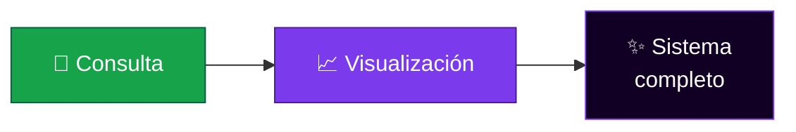

  

<!-- ░░░░░░░░░░░░░░░░░░░░░░░░░░░░░░░░░░░░░░░░░░░░░░░░░░░░░░░░░░░░░░░░ -->

### Python · ESIOS · gráficos · backfill

 

  

<!-- ░░░░░░░░░░░░░░░░░░░░░░░░░░░░░░░░░░░░░░░░░░░░░░░░░░░░░░░░░░░░░░░░ -->

---

## ⚡ Mantenido y evolucionado por **Quantum**

> **PrecioElectricidadPVPC** es un sistema completo para consultar, almacenar y visualizar los precios PVPC de la electricidad (ESIOS) en España.

`ESIOS &nbsp;→&nbsp; consulta &nbsp;→&nbsp; almacenamiento &nbsp;→&nbsp; **gráficos**` ⚡

---

## 🚕 ¿Qué es?

**PrecioElectricidadPVPC** (repo `PrecioElectricidadPVPC`) consulta los precios PVPC de la luz desde ESIOS, los almacena y genera visualizaciones. Es un proyecto open-source (Python) popular.

## ✨ ¿Qué hace?

| | Área | Qué resuelve |
|:--:|------|--------------|
| 🔌 | **Consulta** | Precios PVPC desde ESIOS. |
| 💾 | **Almacenamiento** | Persistencia de precios. |
| 📈 | **Gráficos** | Visualización de precios. |
| ⏪ | **Backfill** | `backfill.py` rellena histórico. |

## 🏗️ Cómo está construido

ESIOS → consulta → almacenamiento → gráficos:

**Stack**

- **Lenguaje** — Python.
- **Fuente** — ESIOS (PVPC).

## 📂 Estructura del repositorio

| Ruta | Contenido |
|------|-----------|
| `consultar.py · backfill.py · graficar.py · main.py` | CLI principal. |
| `src/` | Lógica. |
| `docs/` | Documentación. |

## 🔗 Integraciones

- **ESIOS** — API de precios PVPC.

## 🚀 Entornos y despliegue

- Local / cron para consultas y backfill.

## 💜 Lo que Quantum ha aportado

| | | |
|:--:|:--:|:--:|
| 🔌 **Consulta** | 📈 **Visualización** |
| ESIOS PVPC, backfill | Gráficos |

## 🌟 Hacia dónde va

- Dashboard web.

---

**PrecioElectricidadPVPC** — precios de la luz, hechos crecer por **Quantum** ⚡

