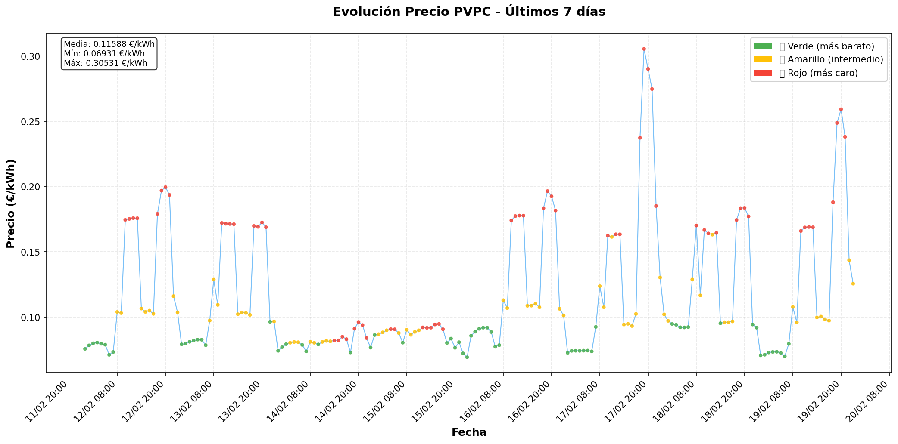
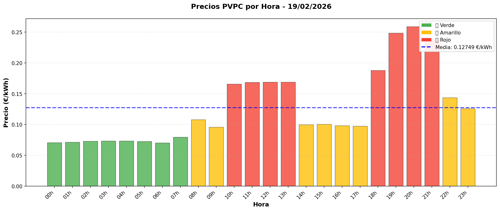

# 🔌 Sistema de Precios PVPC - ESIOS

<div align="center">

[](https://www.python.org/downloads/)
[](LICENSE)
[](https://www.esios.ree.es/es/pagina/api)
[]()

Sistema completo para consultar, almacenar y visualizar precios del **Precio Voluntario para el Pequeño Consumidor (PVPC)** utilizando la API de ESIOS (Red Eléctrica de España).

[Características](#-características) •
[Instalación](#-instalación) •
[Uso](#-uso) •
[Gráficos](#-gráficos) •
[Estructura](#-estructura-del-proyecto) •
[Licencia](#-licencia)

</div>

---

## 📸 Capturas

### Gráfico de Evolución (7 días)


### Gráfico del Día (Por Hora)


---

## 🚀 Características

- ✅ **Consulta en tiempo real** - Obtiene precios PVPC del día actual desde la API de ESIOS
- ✅ **Base de datos SQLite** - Almacenamiento local optimizado con índices
- ✅ **Clasificación por tramos** - Divide automáticamente en 3 tramos de color:
  - 🟢 **Verde**: Las 8 horas más baratas del día
  - 🟡 **Amarillo**: Las 8 horas con precios intermedios
  - 🔴 **Rojo**: Las 8 horas más caras del día
- ✅ **Datos históricos** - Descarga y almacena precios de cualquier fecha pasada
- ✅ **Visualización avanzada** - Gráficos interactivos con Matplotlib
- ✅ **Estadísticas detalladas** - Precio mínimo, máximo y medio
- ✅ **Terminal visual** - Salida colorizada con emojis

---

## 📋 Requisitos

- **Python 3.7+**
- **Clave API de ESIOS** - [Obtener aquí](https://www.esios.ree.es/es/pagina/api) (gratuita)

---

## 🔧 Instalación

### 1. Clonar el repositorio

```bash
git clone https://github.com/tu-usuario/PrecioElectricidadPVPC.git
cd PrecioElectricidadPVPC
```

### 2. Crear y activar entorno virtual

```bash
python3 -m venv venv

# En Linux/macOS
source venv/bin/activate

# En Windows
venv\Scripts\activate
```

### 3. Instalar dependencias

```bash
pip install -r requirements.txt
```

### 4. Configurar API Key

Copia el archivo de ejemplo y añade tu clave API:

```bash
cp .env.example .env
# Edita .env y añade tu clave API de ESIOS
```

El archivo `.env` debe contener:
```env
ESIOS_API_KEY=tu_clave_api_aqui
```

---

## 💻 Uso

### 📅 Obtener precios del día actual

```bash
python main.py
```

**Salida de ejemplo:**
```
🔌 Conectando con API de ESIOS...
📅 Obteniendo precios para 19/02/2026

⏳ Consultando API...
✅ Recibidos 24 precios
💾 Guardando en base de datos...
✅ Guardados 24 registros

Precios PVPC - 19/02/2026
══════════════════════════════════════════════════
Hora  │ Precio (€/kWh) │ Tramo
──────┼────────────────┼───────────
00-01 │  0.07081       │ 🟢 verde
01-02 │  0.07127       │ 🟢 verde
...
20-21 │  0.25909       │ 🔴 rojo
21-22 │  0.23805       │ 🔴 rojo
══════════════════════════════════════════════════
💚 Hora más barata: 06-07 → 0.07009 €/kWh
🔴 Hora más cara:   20-21 → 0.25909 €/kWh
📊 Precio medio:    0.12749 €/kWh
```

### 🔍 Consultar datos históricos (ya descargados)

```bash
# Consultar una fecha específica
python consultar.py 2025-11-03

# Consultar hoy (por defecto)
python consultar.py
```

### ⏳ Descargar datos históricos

```bash
# Rellenar desde una fecha hasta hoy
python backfill.py --start 2024-01-01

# Rellenar un rango específico (ej: últimos 3 meses)
python backfill.py --start 2025-11-01 --end 2025-11-30

# Rellenar todo un año
python backfill.py --start 2024-01-01 --end 2024-12-31

# Forzar actualización de fechas existentes
python backfill.py --start 2024-01-01 --force
```

**Salida de ejemplo:**
```
📅 Rellenando datos históricos
   Desde: 01/11/2025
   Hasta: 30/11/2025

⏳ 01/11/2025 - consultando API... ✅ guardados 24 registros
⏳ 02/11/2025 - consultando API... ✅ guardados 24 registros
...
══════════════════════════════════════════════════
Resumen del backfill:
  Total de días:      30
  ✅ Procesados:      30
  ⏭️  Saltados:        0
  ❌ Errores:         0
══════════════════════════════════════════════════
```

---

## 📊 Gráficos

### Gráfico de evolución (últimos N días)

```bash
# Evolución de los últimos 30 días (por defecto)
python graficar.py --tipo evolucion

# Evolución de los últimos 7 días
python graficar.py --tipo evolucion --dias 7

# Guardar en archivo
python graficar.py --tipo evolucion --dias 30 --guardar evolucion.png
```

### Gráfico de barras por hora (día específico)

```bash
# Gráfico del día de hoy
python graficar.py --tipo dia

# Gráfico de una fecha específica
python graficar.py --tipo dia --fecha 2025-11-03

# Guardar en archivo
python graficar.py --tipo dia --guardar precios_hoy.png
```

---

## 📊 Tramos de Color

Los precios se clasifican automáticamente en **3 tramos** basándose en el precio relativo del día:

| Tramo | Color | Descripción | Horas |
|-------|-------|-------------|-------|
| 🟢 **Verde** | `#4CAF50` | Las horas más baratas | 8 horas |
| 🟡 **Amarillo** | `#FFC107` | Horas con precio intermedio | 8 horas |
| 🔴 **Rojo** | `#F44336` | Las horas más caras | 8 horas |

Esta clasificación te ayuda a identificar rápidamente cuándo es más económico consumir electricidad.

---

## 🗄️ Base de Datos

Los datos se almacenan en **`pvpc.db`** (SQLite) con la siguiente estructura:

```sql
CREATE TABLE precios_pvpc (
    id INTEGER PRIMARY KEY AUTOINCREMENT,
    fecha DATE NOT NULL,
    hora INTEGER NOT NULL,
    precio REAL NOT NULL,
    tramo TEXT,  -- 'verde', 'amarillo', 'rojo'
    created_at TIMESTAMP DEFAULT CURRENT_TIMESTAMP,
    UNIQUE(fecha, hora)
);

CREATE INDEX idx_fecha ON precios_pvpc(fecha);
```

- **Clave única** en `(fecha, hora)` para evitar duplicados
- **Índice** en `fecha` para búsquedas rápidas
- **Soporte UPSERT** para actualizar precios si es necesario

---

## 📁 Estructura del Proyecto

```
PrecioElectricidadPVPC/
├── 📄 .env                     # API key (no se sube a git)
├── 📄 .env.example             # Ejemplo de configuración
├── 📄 .gitignore
├── 📄 requirements.txt         # Dependencias Python
├── 📄 LICENSE                  # Licencia MIT
├── 📄 README.md
│
├── 🐍 main.py                  # Script principal (precios de hoy)
├── 🐍 consultar.py             # Consultar históricos desde BD
├── 🐍 backfill.py              # Descargar históricos desde API
├── 🐍 graficar.py              # Generar gráficos
│
├── 📁 src/
│   ├── __init__.py
│   ├── client.py               # Cliente API ESIOS
│   ├── database.py             # Gestión SQLite
│   ├── indicators.py           # Constantes de indicadores
│   └── models.py               # Modelos y procesamiento
│
├── 📁 docs/
│   └── 📁 images/              # Screenshots para README
│       ├── evolucion_7dias.png
│       └── precios_dia.png
│
└── 📁 venv/                    # Entorno virtual (no en git)
```

---

## 🔑 API de ESIOS

Este proyecto utiliza la **API de ESIOS v2** de Red Eléctrica de España:

- **Base URL**: `https://api.esios.ree.es`
- **Documentación**: [esios.ree.es/es/pagina/api](https://www.esios.ree.es/es/pagina/api)
- **Autenticación**: Clave API (header `x-api-key`)
- **Indicador PVPC**: ID `1001` (Término de facturación de energía activa del PVPC 2.0TD)

### Geografías Disponibles

- 🗺️ **Península** (geo_id: 8741) - *Por defecto*
- 🏝️ Canarias (geo_id: 8742)
- 🏝️ Baleares (geo_id: 8743)
- 🏙️ Ceuta (geo_id: 8744)
- 🏙️ Melilla (geo_id: 8745)

---

## 🛠️ Tecnologías

- **Python 3.7+** - Lenguaje de programación
- **requests** - Peticiones HTTP a la API
- **python-dotenv** - Gestión de variables de entorno
- **matplotlib** - Generación de gráficos
- **SQLite** - Base de datos local

---

## 🤝 Contribuir

Las contribuciones son bienvenidas! Si quieres mejorar este proyecto:

1. Fork el repositorio
2. Crea una rama para tu feature (`git checkout -b feature/AmazingFeature`)
3. Commit tus cambios (`git commit -m 'Add some AmazingFeature'`)
4. Push a la rama (`git push origin feature/AmazingFeature`)
5. Abre un Pull Request

---

## 📝 TODO / Roadmap

- [ ] API REST para servir datos
- [ ] Dashboard web interactivo
- [ ] Notificaciones cuando el precio baje de un umbral
- [ ] Exportación a CSV/Excel
- [ ] Integración con Home Assistant
- [ ] Predicción de precios con ML

---

## 📄 Licencia

Este proyecto está bajo la Licencia MIT. Ver el archivo [LICENSE](LICENSE) para más detalles.

---

## ⚠️ Disclaimer

Este proyecto es **independiente** y no está afiliado con Red Eléctrica de España (REE).

Los datos son proporcionados por ESIOS bajo su licencia de uso. Este software se proporciona "tal cual", sin garantías de ningún tipo.

---

## 👤 Autor

Creado con ❤️ para ayudar a los consumidores a entender y optimizar su consumo eléctrico.

---

## 🌟 ¿Te resulta útil?

Si este proyecto te ha sido útil, considera:
- ⭐ Darle una estrella en GitHub
- 🐛 Reportar bugs o sugerir mejoras
- 🔄 Compartirlo con otros

---

<div align="center">

**[⬆ Volver arriba](#-sistema-de-precios-pvpc---esios)**

</div>
